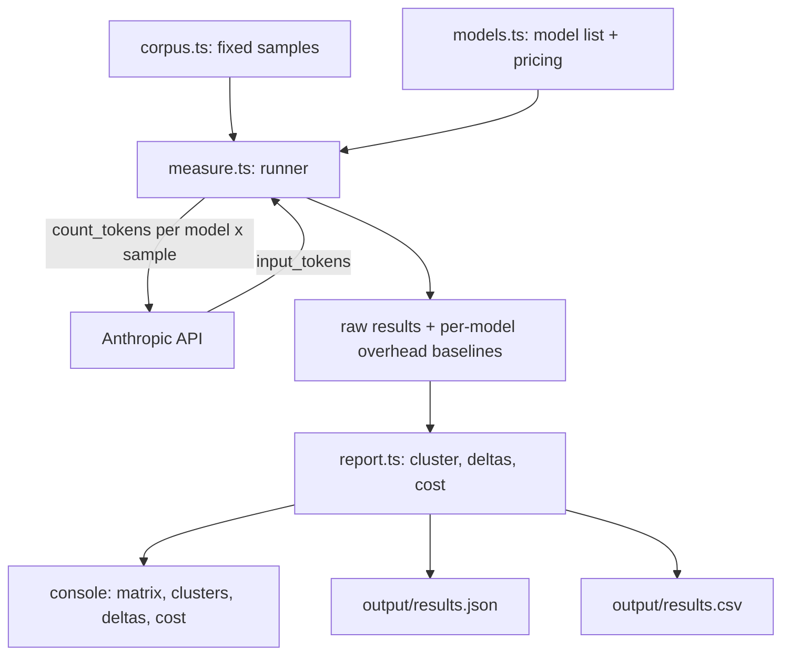

# hakari

A scale (秤) for weighing how much your text costs across Claude models.

`hakari` measures how many **input tokens** each Claude model assigns to the same fixed text, groups models by the tokenizer they share, and converts the counts into dollars. It answers a practical question: for identical input, how many tokens — and therefore how much money — does each model charge, and which models tokenize identically?

## Why this exists

Claude models do not each have their own tokenizer. They fall into families that share one. Two models in the same family produce identical token counts for identical text; two models in different families can differ by roughly 1x–1.35x on the same input. That is a real swing on your input bill, driven purely by which model you picked.

`hakari` does not assume the partition. It **discovers** it: each model gets a vector of token counts across the whole corpus, and models with identical vectors are grouped into the same cluster. If Anthropic ships a new tokenizer, or a model moves families, the clustering reflects what is actually true rather than a hardcoded belief.

## How it works

Token counts come from Anthropic's `count_tokens` endpoint, which returns the input-token count for a message **without generating a completion**. That makes the whole experiment free of generation cost, deterministic, and immune to prompt caching (there is no completion to cache).



The headline metric is **gross real-world input tokens** — the full count the endpoint returns, including the small fixed per-request overhead (role markers and chat-template scaffolding). That is what you actually pay. The per-request overhead is also measured separately and shown beside each cluster so you can audit it.

## Requirements

- Node.js 18 or newer
- npm
- Anthropic credentials (see below)

## Install

```bash
npm install
```

## Authentication

The tool constructs a zero-argument Anthropic client, so it uses whatever ambient credentials it can find. It resolves them in this order (first match wins):

1. `ANTHROPIC_API_KEY` environment variable
2. `ANTHROPIC_AUTH_TOKEN` environment variable
3. An active `ant auth login` OAuth profile
4. Workload Identity Federation
5. The default on-disk profile

You do **not** have to set an API key if you are logged in via `ant auth login` — the client picks up the profile automatically.

One caveat worth knowing before you run: OAuth login tokens are sometimes scoped differently than a raw API key, and `count_tokens` may return `401`/`403` on an OAuth profile even when chat completions work. There is no way to know until the first call. If that happens, the tool prints a clear message telling you to set `ANTHROPIC_API_KEY` or re-run `ant auth login` with API access — it does not fail with a cryptic stack trace.

To use an API key instead of (or in addition to) a profile:

```bash
export ANTHROPIC_API_KEY=sk-ant-...   # macOS / Linux / Git Bash
# PowerShell:  $env:ANTHROPIC_API_KEY = "sk-ant-..."
```

## Run it

```bash
npm run experiment
```

This sweeps every model in `src/models.ts` against every sample in `src/corpus.ts`, prints the results to the console, and writes `output/results.json` and `output/results.csv`.

Exit codes:

- **0** — at least one measurement succeeded; results printed and files written.
- **1** — the whole run failed (no credentials, no connectivity, or every model errored). The tool prints actionable guidance and writes **no** output files, rather than producing a misleading empty result.

A single unavailable model (for example a model your account cannot access, which returns `404`) shows `ERR` in its column and does **not** abort the run — the other models are still measured.

## Reading the output

**Token matrix** — rows are samples, columns are models, cells are input-token counts. `ERR` means that model failed for that sample.

**Tokenizer clusters** — models grouped by identical token vectors. Each member shows its fixed per-request overhead as `[oh=N]`. Because clustering uses gross tokens, two separate clusters that differ by a constant offset on every sample (equal to their overhead gap) may actually share a tokenizer — the overhead display lets you spot that. A within-cluster overhead mismatch prints a `WARNING`.

**Per-category delta** — for each cluster, the percentage difference in tokens per content category (English, code, JSON, non-English) versus the lightest cluster. This is where the family-to-family cost gap becomes concrete.

**Cost table** — total input tokens per model multiplied by that model's cached input price. This is where models that tokenize identically but cost different amounts per token become visible (for example, two models in one cluster with a 2x price gap produce identical token counts and double the dollars).

**Files** — `output/results.json` holds the raw matrix, the per-model overhead baselines, and run metadata; `output/results.csv` is the flat matrix for spreadsheet use. The `output/` directory is git-ignored.

## Generating a Markdown report

After a run, turn `output/results.json` into a human-readable report:

```bash
npm run report
```

This writes `REPORT.md` and needs no credentials — it only reads the JSON a run already produced. The report includes an **index of the actual inputs used** (every measured sample with its full text), the token matrix, the per-request overhead, both gross and overhead-subtracted (content) clustering, a **near-identical tokenizers** section that flags clusters differing on only one or two samples, the per-category deltas, and the cost table.

The report's input index is keyed off the samples that are actually in `output/results.json`, so it always matches the data. If you add a sample to the corpus but have not re-run the experiment, the report says so and tells you to re-run. The workflow is: `npm run experiment` (needs credentials) then `npm run report`.

## Caveats

The model IDs in `src/models.ts` and the input prices are **cached as of 2026-06** and include forward-looking model names. Before quoting any real number, verify both the model IDs (some may not exist for your account yet and will show `ERR`) and the per-token prices against current Anthropic pricing.

## Configuration

- **Change which models are swept** — edit the `MODELS` array in `src/models.ts` (each entry is `{ id, inputPricePerMillion }`).
- **Change the corpus** — edit the `SAMPLES` array in `src/corpus.ts` (each entry is `{ id, category, text }`). To measure your own real prompts, replace the sample text with them.

## Development

```bash
npm test           # run the unit test suite (Vitest)
npm run typecheck  # type-check with tsc --noEmit (no emit)
```

The measurement and analysis logic is fully unit-tested without any network access: `measure.ts` takes an injected count function, and `report.ts` / `report-md.ts` are pure. Only `src/index.ts` and `src/generate-report.ts` (the wiring and file I/O) are exercised by the `npm run experiment` and `npm run report` commands.

### Project structure

| File | Responsibility |
|---|---|
| `src/types.ts` | Shared types (`Sample`, `ModelSpec`, `Measurement`, `RunResult`, …) |
| `src/corpus.ts` | The fixed input corpus (`SAMPLES`) |
| `src/models.ts` | The model sweep list and cached pricing (`MODELS`) |
| `src/measure.ts` | The runner: calls `count_tokens` per model x sample, handles errors and auth |
| `src/report.ts` | Pure analysis: clustering, category totals, category deltas, cost, CSV, overhead adjustment |
| `src/report-md.ts` | Pure Markdown report builder (input index + analysis) |
| `src/index.ts` | Experiment entry point: wires the SDK, prints tables, writes output files |
| `src/generate-report.ts` | Report entry point: reads `output/results.json`, writes `REPORT.md` |
| `tests/` | Vitest unit tests for corpus, models, measure, report, and the report builder |
