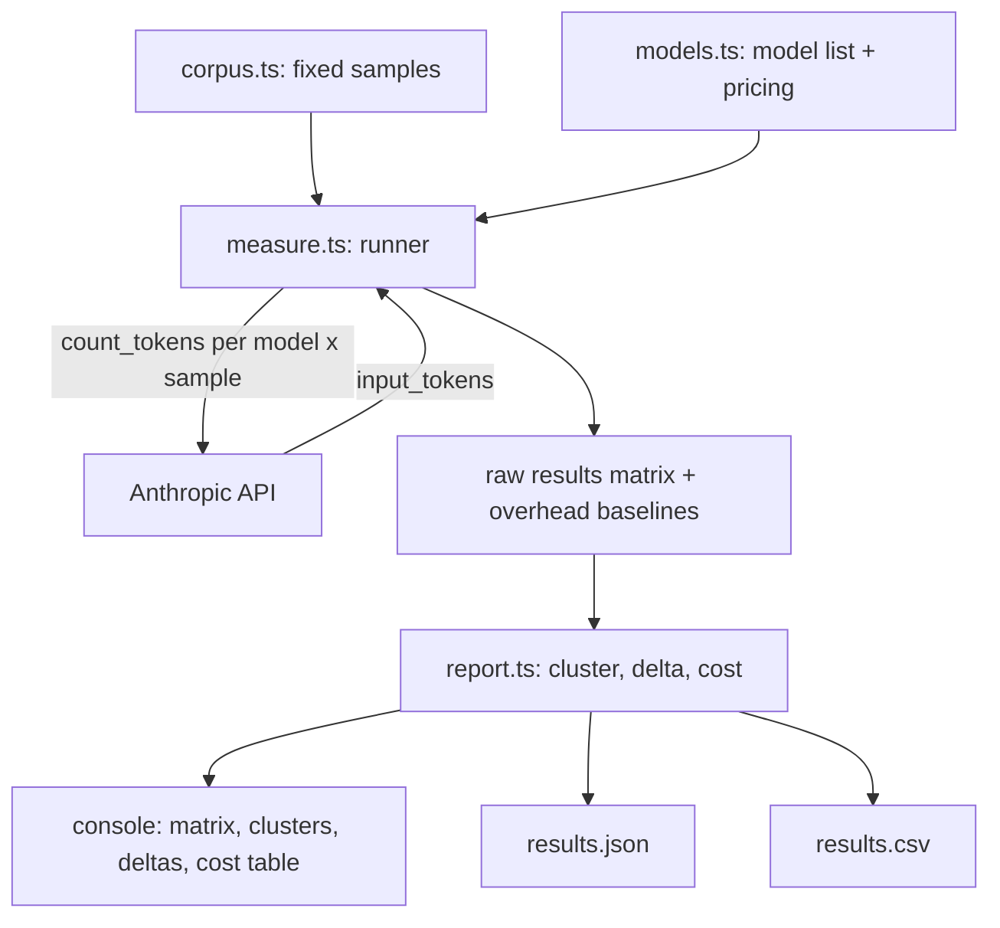

# Claude Tokenizer Measurement Experiment — Design

## Purpose

Measure and compare how different Claude models tokenize the same input text, to quantify the real-world input-token cost of identical content across models. The input is fixed and controlled; output is not measured. The experiment answers: "For the same text, how many input tokens (and therefore how many dollars) does each Claude model charge, and which models share a tokenizer?"

## Background and the key finding this experiment tests

Claude models do not each have a distinct tokenizer. They cluster into families. Based on the current Anthropic reference, two families are expected: a "new" tokenizer introduced with Opus 4.7 (shared by Opus 4.7, Opus 4.8, Sonnet 5, and Fable 5) and an "old" tokenizer used by Opus 4.6, Sonnet 4.6, Haiku 4.5, and earlier. The new tokenizer produces roughly 1x to 1.35x as many tokens as the old one for the same text.

The experiment must not assume this partition. It must discover it from measured data. If the expectation is wrong, or if Anthropic changes tokenizers, the experiment reports what is actually true rather than confirming a prior belief.

## Goals

Quantify, per content category, the input-token count each model assigns to a fixed corpus.

Discover the tokenizer-family partition empirically by clustering models whose token-count vectors are identical.

Translate token counts into dollar cost per model using cached input pricing, surfacing cases where models share a tokenizer but differ in price (for example Fable 5 and Opus 4.8 are expected to tokenize identically while Fable 5 costs twice as much per token).

## Non-goals

Measuring output tokens or generation behavior.

Making real completion calls. Token counting uses the dedicated count-tokens endpoint, so no generation occurs and prompt caching is irrelevant by construction.

Reverse-engineering token boundaries or merges. This is a cost-comparison experiment, not a linguistic autopsy.

Any charting, configuration framework, or persistence beyond flat result files.

## Measurement method

Token counts come from `POST /v1/messages/count_tokens` via the Anthropic TypeScript SDK (`client.messages.countTokens`). This endpoint returns `input_tokens` for a given model and message set without generating a completion. It is deterministic, free, and unaffected by caching.

The headline metric is gross real-world input tokens: the full count the endpoint returns, including the fixed per-request overhead (role markers and chat-template scaffolding). This is what a caller actually pays, which matches the cost-comparison goal.

As a diagnostic only, the experiment also measures a per-model overhead baseline by counting a near-empty message. This lets the report state how many of the gross tokens are fixed overhead versus content, without changing the headline metric.

## Authentication

The SDK uses ambient credential resolution via a zero-argument client (`new Anthropic()`). Credentials resolve in order: `ANTHROPIC_API_KEY`, then `ANTHROPIC_AUTH_TOKEN`, then an active `ant auth login` OAuth profile, then Workload Identity Federation, then the default on-disk profile. No API key is hardcoded and none needs to be set if an OAuth profile is active.

Caveat: OAuth login tokens may be scoped differently than a raw API key, and the count-tokens endpoint could return 401 or 403 on an OAuth profile even when completions work. The outcome is unknown until the first call. The runner treats an authentication failure as a clear, actionable error that names the one-line fix (set `ANTHROPIC_API_KEY` or re-run `ant auth login` with API scope), rather than emitting a raw stack trace.

## Components

The experiment is built in TypeScript using `@anthropic-ai/sdk`, organized into focused modules.

`corpus.ts` — the fixed input samples as an array of `{ id, category, text }`. Four categories are covered because they are where tokenizers diverge most: English prose, source code, JSON, and non-English text (CJK plus accented Latin). Roughly three to four samples per category, each sized large enough that counts are stable and comparable across models.

`models.ts` — the model sweep list plus cached input pricing in dollars per million tokens, with an explicit comment that pricing is cached as of 2026-06 and per-token rates should be re-verified before drawing cost conclusions. The default sweep spans both suspected families so the partition is visible in the results: new-family suspects `claude-opus-4-8`, `claude-opus-4-7`, `claude-sonnet-5`, `claude-fable-5`; old-family suspects `claude-opus-4-6`, `claude-sonnet-4-6`, `claude-haiku-4-5`.

`measure.ts` — the runner. For each model and sample pair it calls the count-tokens endpoint and records `input_tokens`. It also records one overhead-baseline measurement per model. The SDK's built-in retry handles rate limiting and transient server errors. A model that is unavailable (for example a 404) is caught, logged, and skipped, leaving the rest of the run intact. An authentication failure produces the actionable error described above.

`report.ts` — analysis and rendering. It performs the clustering (grouping models by identical token-count vectors across all samples), computes per-category deltas between families, and computes dollar cost per model per sample from token counts and cached pricing.

## Data flow

## Output

Console output has four parts: a matrix of samples (rows) by models (columns) showing token counts; a cluster summary that names which sets of models are tokenizer-identical; per-category family deltas expressed as a ratio (for example "code +31%, JSON +22%, English +14%, CJK +9%"); and a cost table showing dollars per sample per model, where the shared-tokenizer-but-different-price cases become visible.

File output goes to an output directory: `results.json` containing the raw matrix, overhead baselines, and run metadata; and `results.csv` for spreadsheet use.

## Error handling summary

Rate limits and 5xx errors are retried by the SDK.

An unavailable or unknown model is logged and skipped without aborting the run.

An authentication failure stops the run with a clear message naming the fix.

Missing or malformed responses are reported per cell so a single bad measurement does not corrupt the whole matrix.

## Success criteria

The experiment runs end to end against the configured model sweep and produces the console output and both result files.

The cluster summary correctly groups models by identical token-count vectors, empirically reproducing (or contradicting) the expected two-family partition.

The cost table correctly reflects token counts multiplied by cached per-model input pricing, making the shared-tokenizer, different-price cases explicit.
